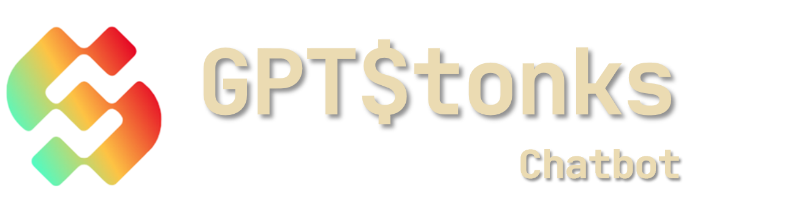

<p align="center">
  
</p>
<p align="center">
  <!-- Waitlist Badge -->
  <a href="https://gptstonks.net/joinwaitlist"></a>
  <!-- YT Badge -->
  <a href="https://www.youtube.com/@GPTStonks"></a>
  <!-- X Badge -->
  <a href="https://twitter.com/GPTStonks"></a>
  <!-- Discord Badge -->
  <a href="https://discord.gg/MyDDGuEd"></a>
  <!-- Docker Badge -->
  <a href="https://hub.docker.com/u/gptstonks">
    
  </a>
</p>
<p align="center">
  <!-- Hugging Face Badge -->
  <a href="https://huggingface.co/"></a>
  <!-- LangChain Badge -->
  <a href="https://langchain.com/">
    
  </a>
  <!-- FastAPI Badge -->
  <a href="https://fastapi.tiangolo.com/">
    
  </a>
  <!-- OpenBB Badge -->
  <a href="https://openbb.co/">
    
  </a>
</p>

# GPTStonks Chatbot API

Welcome to the GPTStonks Chatbot API documentation! This API allows you to interact with a powerful financial chatbot built on top of the `openbb` framework. Whether you're a developer looking to integrate financial chat capabilities into your application or a trader seeking automated financial insights, this API is designed to provide you with a seamless and customizable experience.

## Table of Contents

- [GPTStonks Chatbot API](#gptstonks-chatbot-api)
  - [Table of Contents](#table-of-contents)
  - [Introduction 🌟](#introduction-)
  - [Features 🚀](#features-)
  - [Supported LLM Providers](#supported-llm-providers)
  - [Supported Embeddings Providers](#supported-embeddings-providers)
  - [Getting Started 🛠️](#getting-started-%EF%B8%8F)
    - [Prerequisites](#prerequisites)
    - [Full deployment \[api + frontend + db\] (recommended)](#full-deployment-api--frontend--db-recommended)
    - [Installation 🛸](#installation-)
  - [For Production Environments 🏭](#for-production-environments-)
  - [Usage💡](#usage)
  - [API Endpoints🌐](#api-endpoints)
  - [Configuration with environment variables ⚙️](#configuration-with-environment-variables-%EF%B8%8F)
  - [Contributing 🤝](#contributing-)
  - [License 📃](#license-)

## Introduction 🌟

GPTStonks is a financial chatbot powered by LLMs and enhanced with the openbb framework. It provides natural language conversation capabilities for financial topics, making it an ideal choice for a wide range of financial applications, including:

- Learning about the financial markets
- Improving trading strategies
- Financial news analysis: sentiment, trends, etc.
- Customer support for financial institutions

This API allows you to integrate the GPTStonks financial chatbot into your projects, enabling real-time financial chat interactions with users.

## Features 🚀

- **Real-time Financial Chat**: Engage in natural language conversations about financial topics.
- **Customizable Responses**: Tailor the chatbot's responses to suit your specific use case.
- **Easy Integration**: Built on FastAPI, this API is designed for straightforward integration into your application or platform.
- **Extensive Documentation**: Detailed documentation and examples to help you get started quickly.

## Supported LLM Providers

- **[Llama.cpp](https://github.com/ggerganov/llama.cpp)**: optimized implementations of the most popular open source LLMs for inference over CPU and GPU. See their docs for more details on supported models, which include Mixtral, Llama 2 and Zephyr among others. Many quantized models (GGUF) can be found in Hugging Face under the user [TheBloke](https://huggingface.co/TheBloke).
- **[Amazon Bedrock](https://aws.amazon.com/bedrock/)**: foundation models from a variety of providers, including Anthropic and Amazon.
- **[OpenAI](https://platform.openai.com/docs/models)**: GPT family of foundation models. For now only `instruct` versions are supported, such as `gpt-3.5-turbo-instruct`. Chat versions will be added soon.
- **[Vertex AI](https://cloud.google.com/vertex-ai)**: similar to Amazon Bedrock but provided by Google. This integration is in alpha version, not recommended for now.

## Supported Embeddings Providers

- **[OpenAI Embeddings](https://platform.openai.com/docs/models/embeddings)**: includes models such as Ada 2.
- **[Hugging Face](https://huggingface.co/)**: including providers such as BAAI, see their general embedding (BGE) [model list](https://huggingface.co/BAAI/bge-large-en-v1.5#model-list).

## Getting Started 🛠️

### Prerequisites

Before you begin, make sure you have [Docker](https://docs.docker.com/engine/install/) installed on your system.

### Full deployment \[api + frontend + db\] (recommended)

1. Clone this repository to your local machine:

```bash
git clone https://github.com/gptstonks/api.git
```

2. Check the `.env.template` file for the required environment variables. Modify the values as desired and save the file.

3. Run the docker-compose file:

```bash
docker-compose up
```

4. If you didn't change any port configuration, navigate to `http://localhost:3000` to access the frontend.

5. (optional) If you want to use your `OpenBB` PAT to access resources, you can set it from the API Keys section (sidebar) in the frontend.

### Installation 🛸

1. Set up environment variables by creating a `.env` file in the project directory with the contents specified in `.env.template`.

2. **\[Highly Recommended\] Option 1:** use the latest Docker image in [ghcr.io](https://github.com/features/packages).

```bash
docker run -it -p 8000:8000 --env-file .env ghcr.io/gptstonks/api:main
```

- **Option 2:** build from source.

  1. Install [PDM](https://pdm.fming.dev/latest/#installation) for a faster install.

  2. Clone this repository to your local machine:

  ```bash
  git clone https://github.com/GPTStonks/api.git
  ```

  2. Navigate to the project directory:

  ```bash
  cd gptstonks_api
  ```

  3. Install the required dependencies:

  ```bash
  pdm install --no-editable --no-self
  ```

  4. Create `openssl.cnf` to allow legacy TLS renegotiation, needed for OECD data in OpenBB.

  ```bash
  echo 'openssl_conf = openssl_init\n\
  \n\
  [openssl_init]\n\
  ssl_conf = ssl_sect\n\
  \n\
  [ssl_sect]\n\
  system_default = system_default_sect\n\
  \n\
  [system_default_sect]\n\
  Options = UnsafeLegacyRenegotiation'\
  > openssl.cnf
  ```

  5. Start the API:

  ```bash
  uvicorn gptstonks_api.main:app --host 0.0.0.0 --port 8000
  ```

Now your GPTStonks Financial Chatbot API is up and running!

## For Production Environments 🏭

For production environments, additional steps are necessary to ensure security and stability:

Ensure that uvicorn is configured with SSL certificates for secure HTTPS communication.

Build the Docker image from source:

```bash
docker build -t gptstonks-api:v0.1_pro -f Dockerfile.pro .
```

Now you can run the Docker image with the following command:

```bash
docker run -it -p 443:8000 \
-v /etc/letsencrypt/live/api.gptstonks.net/fullchain.pem:/api/cert.pem \
-v /etc/letsencrypt/live/api.gptstonks.net/privkey.pem:/api/key.pem \
--env-file .env gptstonks-api:v0.1_pro
```

## Usage💡

To use the GPTStonks Financial Chatbot API, send HTTP requests to the provided endpoints. You can interact with the chatbot by sending messages and receiving responses in real-time.

## API Endpoints🌐

Check `http://localhost:8000/docs` once the API is started to access the endpoints' documentation.

## Configuration with environment variables ⚙️

| Env variable                                   | Required | Default                                     | Description                                                                                           |
| ---------------------------------------------- | -------- | ------------------------------------------- | ----------------------------------------------------------------------------------------------------- |
| MONGO_URI                                      | Yes      | -                                           | MongoDB's URI to connect.                                                                             |
| MONGO_DBNAME                                   | Yes      | -                                           | MongoDB's database to use.                                                                            |
| AUTOLLAMAINDEX_VSI_GDRIVE_URI                  | No       | None (Not downloaded)                       | Google Drive's URL to download Vector Store Index (VSI).                                              |
| AUTOLLAMAINDEX_EMBEDDING_MODEL_ID              | No       | "local:BAAI/bge-large-en-v1.5"              | Embedding model ID to use with AutoLlamaIndex (must match with VSI).                                  |
| AUTOLLAMAINDEX_SIMILARITY_POSTPROCESSOR_CUTOFF | No       | 0.5                                         | Minimum similarity required when retrieving similar documents.                                        |
| AUTOLLAMAINDEX_REMOVE_METADATA_POSTPROCESSOR   | No       | None (Postprocessor used)                   | Whether or not to use a metadata postprocessor.                                                       |
| AUTOLLAMAINDEX_VSI_PATH                        | Yes      | -                                           | Path to the downloaded VSI. If AUTOLLAMAINDEX_VSI_GDRIVE_URI is given, they will match automatically. |
| AUTOLLAMAINDEX_LLM_CONTEXT_WINDOW              | No       | 4096                                        | Context window to use when a Hugging Face model is loaded in AutoLlamaIndex.                          |
| AUTOLLAMAINDEX_QA_TEMPLATE                     | No       | None (LlamaIndex's Default QA Template)     | Template to use with LlamaIndex question-answering step.                                              |
| AUTOLLAMAINDEX_REFINE_TEMPLATE                 | No       | None (LlamaIndex's Default Refine Template) | Template to use with AutoLlamaIndex refine step.                                                      |
| AUTOLLAMAINDEX_VIR_SIMILARITY_TOP_K            | No       | 3                                           | K most similar elements are retrieved with vector search.                                             |
| AUTOLLAMAINDEX_RETRIEVER_TYPE        | No       | None (Hybrid retrieved used)                | Whether or not to use BM25 with vector search (hybrid) or only vector search.                         |
| AUTOMULTISTEPQUERYENGINE_QA_TEMPLATE        | No       | None (LlamaIndex's Default QA Template)                | Template to use with AutoMultiStepQueryEngine question-answering step.                         |
| AUTOMULTISTEPQUERYENGINE_REFINE_TEMPLATE        | No       | None (LlamaIndex's Default Refine Template)                | Template to use with AutoMultiStepQueryEngine refine step.                         |
| AUTOMULTISTEPQUERYENGINE_STEPDECOMPOSE_QUERY_PROMPT        | No       | None (LlamaIndex's Default Step Decompose Template)                | Template to use with AutoMultiStepQueryEngine step decompose.                         |
| AGENT_REQUEST_TIMEOUT                          | No       | 20                                          | No. seconds to wait before timeout when an API LLM is used (e.g., OpenAI).                            |
| AGENT_EARLY_STOPPING_METHOD                    | No       | "force"                                  | How the model should return its final output when early stopping is applied.                          |
| LLM_TEMPERATURE                                | No       | 0.1                                         | Temperature to use when sampling.                                                                     |
| LLM_MAX_TOKENS                                 | No       | 256                                         | No. max. tokens to sample.                                                                            |
| LLM_TOP_P                                      | No       | 1.0                                         | Top-p parameter to apply when sampling.                                                               |
| LLM_MODEL_ID                                   | Yes      | -                                           | ID of the model to use. See tutorials in GPTStonks' blog for more details.                            |
| LLM_CHAT_MODEL_SYSTEM_MESSAGE                  | No       | "You write concise and complete answers."   | System message when using chat models (e.g., GPT-4).                                                  |
| LLM_VERTEXAI_CLOUD_LOCATION                    | No       | None                                        | Google Cloud location to use with VertexAI.                                                           |
| LLM_LLAMACPP_CONTEXT_WINDOW                    | No       | 4000                                        | Context window to apply when a model is loaded with Llama.cpp.                                        |
| LLM_HF_DEVICE                                  | No       | -1                                          | Device to use with Hugging Face's models.                                                             |
| LLM_HF_DISABLE_SAMPLING                        | No       | False                                       | Whether or not to disable sampling when generating with Hugging Face's models.                        |
| LLM_HF_DEVICE_MAP                              | No       | None (HuggingFacePipeline default)          | Device map to use with Hugging Face's models.                                                         |
| LLM_HF_BITS                                    | No       | 4                                           | No. bits of quantized Hugging Face's model.                                                           |
| LLM_HF_DISABLE_EXLLAMA                         | No       | False                                       | Whether or not to disable ExLlama with Hugging Face's models.                                         |
| LLM_HF_TRUST_REMOTE_CODE                       | No       | False                                       | Whether or not to trust remote code with Hugging Face's models.                                       |
| OPENBBCHAT_TOOL_DESCRIPTION                    | Yes      | -                                           | OpenBB Platform's tool description for the LLM agent.                                                 |
| SEARCH_TOOL_DESCRIPTION                        | No       | None (Default DDG Search description)       | DDG's search tool description for the LLM agent.                                                      |
| CUSTOM_GPTSTONKS_PREFIX                        | No       | None (Default LangChain agent prefix)       | Prefix to use with LLM agent.                                                                         |

## Contributing 🤝

We welcome contributions from the community! If you have any suggestions, bug reports, or want to contribute to the project, feel free to open issues or propose changes.

## License 📃

This project is licensed under the MIT License - see the [LICENSE](LICENSE) file for details.
