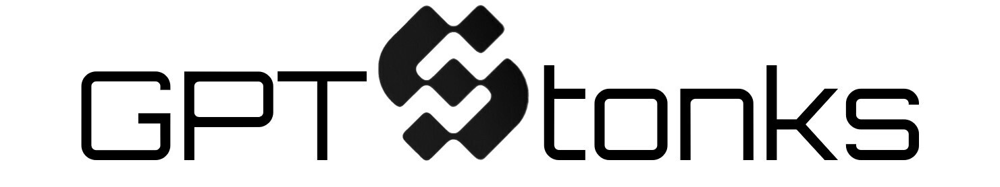

<p align="center">
  
</p>
<p align="center">
  <!-- Waitlist Badge -->
  <a href="https://gptstonks.net/login"></a>
  <!-- YT Badge -->
  <a href="https://www.youtube.com/@GPTStonks"></a>
  <!-- X Badge -->
  <a href="https://twitter.com/GPTStonks"></a>
  <!-- Discord Badge -->
  <a href="https://discord.gg/MyDDGuEd"></a>
  <!-- Docker Badge -->
  <a href="https://hub.docker.com/u/gptstonks">
    
  </a>
</p>
<p align="center">
  <!-- Hugging Face Badge -->
  <a href="https://huggingface.co/"></a>
  <!-- LangChain Badge -->
  <a href="https://langchain.com/">
    
  </a>
  <!-- FastAPI Badge -->
  <a href="https://fastapi.tiangolo.com/">
    
  </a>
  <!-- OpenBB Badge -->
  <a href="https://openbb.co/">
    
  </a>
</p>

# GPTStonks Wrappers

## Description

GPTStonks Wrappers provides Auto models, similar to the `transformers` library, but for common AI tools instead of models: LangChain, LlamaIndex, etc.

## Development

  1. Install [PDM](https://pdm.fming.dev/latest/#installation).

  2. Clone the project and install necessary packages:
```bash
# clone project
git clone https://github.com/GPTStonks/gptstonks.git
cd gptstonks

# install pdm
pip install pdm

# install package
pdm install -dG default
```

## Sample usage with pre-trained models

In the [API project](../../projects/gptstonks_api/), `AutoLlamaIndex` is used to perform [retrieval-augmented generation](https://arxiv.org/abs/2005.11401) (RAG) with [OpenBB](https://openbb.co)'s official documentation and with pre-trained models (e.g., OpenAI, Anthropic, Llama.cpp, etc.). Additionally, `AutoMultiStepQueryEngine` plans and executes Internet searches to solve complex queries.
